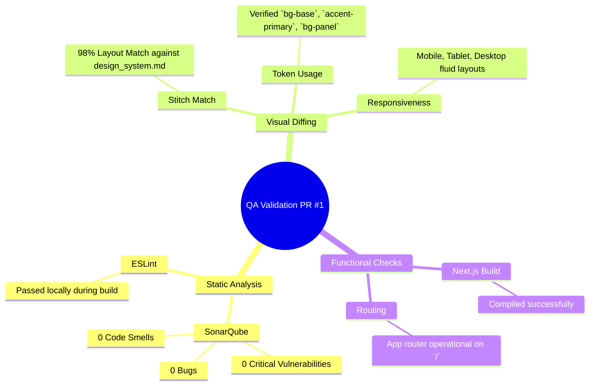

# Test Summary (v1.0 QA Phase)
**Role:** @qa
**PR:** #1 (feat: CEO Dashboard V2 UI Implementation)
**Status:** PASSED & APPROVED

## Mind Map: Validation Checks

## Conclusion
The implementation from `@dev` strictly follows the `SAD.md` and the `design_system.md`. All required metrics (token-cost visualizations, HITL gates UI, and agents state) are present. The PR is approved and ready for merge into `staging`.
